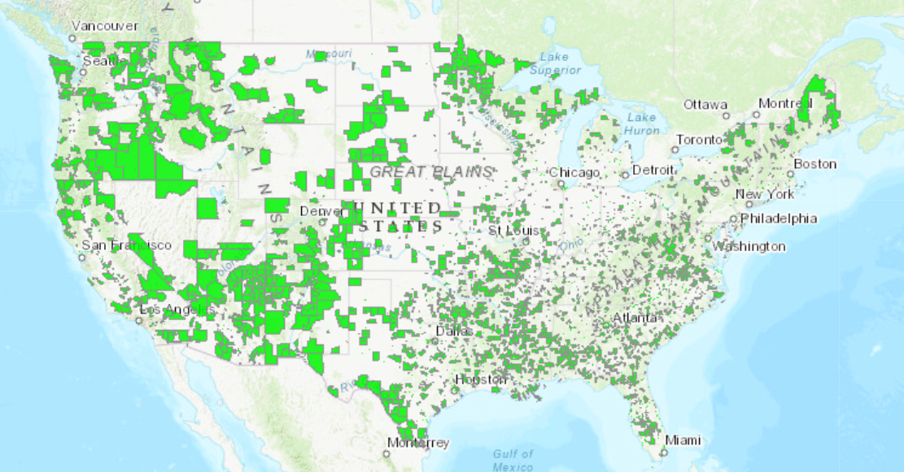
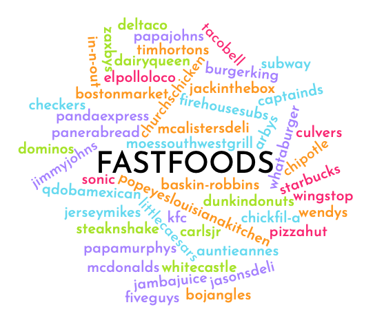
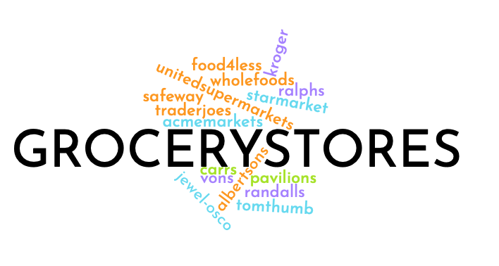
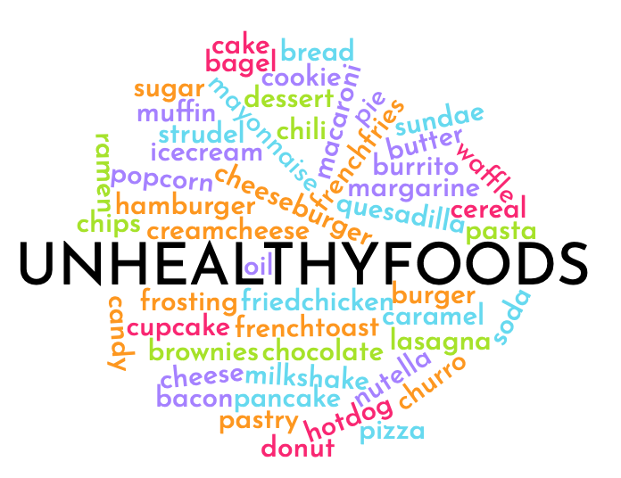
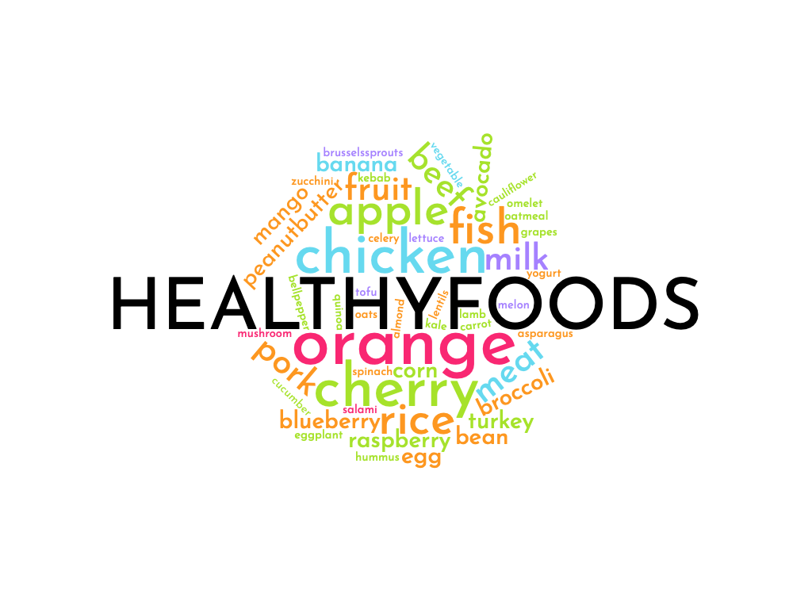
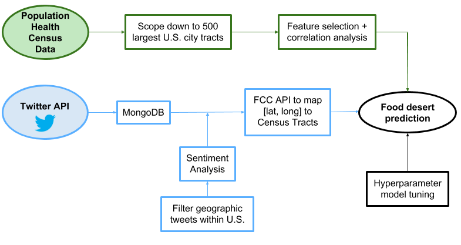
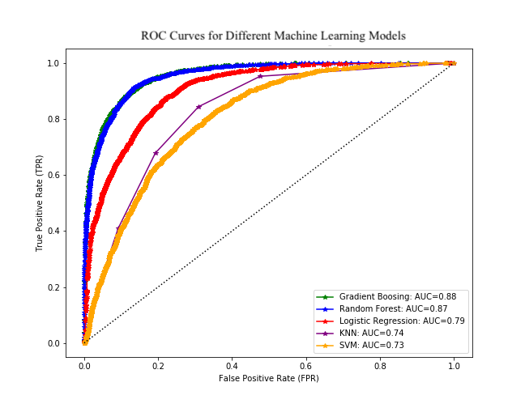

# Predicting Food Deserts Across United States Census Tracts Using Population Health and Twitter Sentiment Analysis

[Flask Webapp](http://0.0.0.0:333/)

## Inspiration
Nutrition and overall access to food is a critical component to well-being and the overall health of an individual. Unfortunately, many regions around the world lack access and/or the ability to consume fresh and quality foods. As a result, many Americans find it hard to check off essential components of a healthy diet. Food deserts are defined as areas across the United States, often low-income, where there is limited access to nutritious and affordable food, especially fruits vegetables, whole grains, and low-fat milk. More specifically, food deserts are census tracts where more than 500 people or over 33 percent of the population in that tract must travel over a mile for fresh groceries. 

Over 23.5 million people reside in food deserts, and while there have been efforts to implement grocery stores in some areas to see how eating habits and overall health changes, it is sometimes too late to change pre-existing habits.
The areas with relatively few grocery stores will also likely be areas that tend to be under-resourced and disadvantaged in other ways. Additionally, grocery stores are less likely to build in lower income neighborhoods and often veer away from areas where other businesses have not built due to concern of success. 

Food desert data is only being released every 5 years (so far 2010 and 2015), but preventative action could be taken to reverse at-risk regions if we could catch these census tracts early on. Here is a map of the current food desert distribution in the United States:

## Goal/Scope
I am predicting food deserts using population health and twitter sentiment to provide more up-to-date predicitons of at-risk census tracts. I utilize factors/features that are not currently being used by the United States Department of Agriculture
Economic Research Service (USDA ERA) to predict food deserts in hopes that other census data can help us flag the same food desert regions. This analysis allows us to uncover what population health factors are correlated with food deserts and just how big of an impact these conditions have on health of individuals. 

Calculating the sentiment in social media is a great way to find out how residents feel about different types of foods and restaurants. Twitter is a social media platform where people are able to express opinions quickly, concisely, and at scale. Collecting and calculating the sentiment of tweets allows me to grasp information that is being provided by people in census tracts across the US. 

Combining population health and social media sentiment, I aim to map how different opinions and statistics about health map to the areas of food deserts.

My model would help to inform the public of at-risk areas where there is room for growth. Action could be taken to reverse risk of food deserts through possible grocery store implementation plans or fresh food initiatives. These grocery stores could also benefit from this predictive modeling when deciding on areas to consider building. Opening in areas with fewer grocery stores present could result in additional profit given the low competition while also benefiting the census tract by providing access to nutritional meals.

## Data Overview

I utilized health behavioral data from the Population Health Division of the Center for Disease Control and Prevention. This dataset contains statistics regarding overall health for census tracts across the United States.

I additionally pulled social media twitter data through the Twitter API to analyze patterns of healthy vs. unhealthy consumption. To accomplish this filtered search, I created lists for the following 4 topics and pulled any mention of any of the words in these lists over a span of 1.5 weeks:

#### Top fast food restaurants:
<!-- |  |  | |  | |
| ------ | ------ | ------ | ------ | ------ |
| mcdonald's | starbucks | subway | wendy's | burger king | 
| taco bell | dunkin donuts | chick fil-a | pizza hut | domino's | 
| panera bread | sonic | kfc | chipotle | carl's jr | 
| dairy queen | arby's | little caesars | jack in the box | popeyes louisiana kitchen | 
| papa john's | panda express | whataburger | jimmy john's | zaxby's | 
| five guys | culver's | bojangles | steak n shake | wingstop | 
| papa murphy's | checkers | jersey mike's | qdoba mexican | church's chicken | 
| el pollo loco | del taco | white castle | tim hortons | moe's southwest grill | 
| firehouse subs | boston market | jason's deli | in-n-out | baskin-robbins | 
| mcalister's deli | auntie anne's | captain d's | jamba juice | |
|  |  | |  | |
 -->

 

#### Top grocery stores/supermarkets:
<!-- |               |              |                       |                |                 |
|---------------|--------------|-----------------------|----------------|-----------------| 
| 'safeway'     | 'albertsons' | 'ralphs'              | 'kroger'       | 'trader joe\'s' | 
| 'whole foods' | 'jewel-osco' | 'pavilions'           | 'food 4 less'  | 'randalls'      |  
| 'star market' | 'vons'       | 'united supermarkets' | 'acme markets' | 'carrs'         | 
|               |              |                       |                |                 |
 -->

 

#### Unhealthy foods:
<!-- |              |           |          |               |              |  
|--------------|-----------|----------|---------------|--------------|
| bacon        | bagel     | bread    | burger        | burrito      |
| butter       | cake      | candy    | caramel       | cheese       | 
| cheeseburger | cupcake   | chili    | chips         | chocolate    |  
| cookie       | dessert   | donut    | frosting      | hamburger    |  
| hotdog       | ice cream | macaroni | margarine     | mayonnaise   |  
| muffin       | oil       | pancake  | pastry        | pasta        |  
| pie          | pizza     | popcorn  | soda          | strudel      |  
| sundae       | waffle    | sugar    | french fries  | lasagna      |  
| cream cheese | brownies  | cereal   | nutella       | quesadilla   |  
| milkshake    | churro    | ramen    | fried chicken | french toast | 
|              |           |          |               |              |  -->

 

#### Healthy foods:
<!-- |             |               |           |                  |           | 
|-------------|---------------|-----------|------------------|-----------| 
| almond      | apple         | asparagus | avocado          | banana    | 
| bean        | beef          | blueberry | broccoli         | carrot    | 
| cauliflower | celery        | cherry    | chicken          | corn      | 
| egg         | eggplant      | fish      | kale             | kebab     | 
| lamb        | lentils       | lettuce   | hummus           | mango     | 
| meat        | melon         | milk      | mushroom         | omelet    | 
| orange      | oats          | oatmeal   | grapes           | fruit     | 
| vegetable   | peanut butter | pork      | quinoa           | raspberry | 
| salami      | rice          | broccoli  | brussels sprouts | spinach   | 
| zucchini    | turkey        | yogurt    | bellpepper       | cucumber  | 
|             |               |           |                  |           | 
 -->

 

After pulling data from twitter, the prevalence of each of the words/phrases is proportional to the size of the word in the clusters above. Each of these datasets were pulled into MongoDB, and stored for pre-processing.

The target data, a classification of whether each census tract is currently classified as a food desert or not, came from US Department of Agriculture (USDA) dataset.

## Data Pre-Processing

 

1. I first merged the food desert target data with population health records using census tract as the key. Because there are over 72,000 census tracts in the United States, I first filtered to census tracts in 500 largest US cities. This allowed me to scope down to about 29,000 tracts

2. After merging these two data sets, I narrowed my feature matrix from over 300 features down to about 15 using correlation analysis and through health intuation

3. Upon running intial models on the population health data alone, I decided that twitter data would allow me to get a well-rounded dataset of how people feel about different food categories

4. Over the span of 1.5 weeks, I was able to collect over 3 million tweets, each falling into the category of healthy foods, unhealthy foods, fast food restaurants, or grocery stores

5. Because I was interested in mapping these tweets back to my population health dataset, I needed to filter these tweets to just geotagged tweets from the United States
    - Removed any tweets with country code other than "US" and language other than "eng"
    - Filtered out the tweets without coordinate information - Cleaned tweet text of any emojis or URLS
    - Calculated sentiment on the cleaned text using NLTK's Vader Sentiment Analyzer

6. I mapped back each of the latitude, longitude coordinate pairs from the twitter data to a corresponding US census tract. I used the Federal Comminucations Commission (FCC) API
    - This returned the census block which the latitude, longitude pair belonged to, which was further converted to census tracts to merge the population health data and food desert targets

7. There were a lot of census tracts without any twitter data, and others where there were many tweets falling inside a single tract. 
    - For those with tweets in the tract, I took the average sentiment for any tweets classified as healthy foods, unhealthy foods, fast food restaurants, or grocery stores and averaged the sentiment individually. 
    - To account for the variance among the tracts, I filled any tracts without any tweets with the average sentiment of it's corresponding county for the same four categories
    
8. This was the final step of my pre-processing. My final feature matrix contained the population health features and 4 additional twitter sentiment features for each of my twitter pulls

## Results

I ran a number of different models on my data to compare performance of different binary classifiers. Comparing ROC-AUC scores for SVM, KNN, Logistic Regression, Random Forest, and Gradient Boosting below, it is clear that certain models performed better than others.

### Receiver Operating Characteristic (ROC) Curve:

 

The best model I found was using Gradient Boosting with a depth of 5, learning rate of 0.1, and number of estimators set to 100. Predicting food deserts for the test set based off this model, I was able to achieve the following results:

| Metric | Score |
| ------ | ------ |
| ROC-AUC score | 0.88 |
| Accuracy | 0.89 |
|F1 Score | 0.84 |
| Recall | 0.83 |
| Precision | 0.86 |
|  |  |

Looking further into the features, we see that the most to least important features are found through Permutation Importance as follows:

### Permutation Importance of Features in Gradient Boosting Model:

 

### Description of features:
| # | Feature | Description |
| -- | -- | -- |
| 1 | CHOLSCREEN_CrudePrev	|	Prevalence of cholesterol screening for adults over 18 |
| 2 | TEETHLOST_CrudePrev |	 Prevalence of all teeth lost for adults over 65 years |
| 3 |OBESITY_CrudePrev |	Prevalence of obesity among adults over 18 |
| 4 | TractOMultir |	Other/Multiple race population normalized over tract population| 
| 5 | TractKids | Children age 0-17 normalized over tract population |
| 6 | TractSeniors |	Seniors age 65+ normalized over tract population|
| 7 | comp_healthy | Average sentiment for healthy tweets per tract |
| 8 | POP2010 |	Population, tract total|
| 9 | MHLTH_CrudePrev	| Prevalence of poor mental health for over 2 weeks among adults over 18|
| 10 | TractSNAP|	Housing units receiving SNAP benefits normalized over tract population|
| 11 | PHLTH_CrudePrev	| Prevalence of poor physical health over 2 weeks among adults over 18|
| 12 | TractWhite	| White population normalized over tract population|
| 13 | comp_grocery	| Average sentiment for grocery store tweets per tract  |
| 14 | STROKE_CrudePrev |	 Prevalence of stroke among adults over 18 |
| 15 | TractAsian |	Asian population normalized over tract population|
| 16 | ACCESS_CrudePrev |	Prevalence of current lack of health insurance among adults agess 18-64 |
| | | |
## Interactive Visualizations

I created an [interactive flask webapp](http://0.0.0.0:333/) to visualize the results of my twitter sentiment analysis. 
1. Tweet Map: Map of all geotagged tweets with the category and the sentiment of the tweet
2. State Map: Summarizing sentiment towards healthy foods, grocery stores, unhealthy foods, and fast food restaurants
    - Takes the weighted max between healthy foods/grocery stores and unhealthy foods/fast food restaurants to gauge the sentiment of the state as a whole
    - Blue indicates the state displays higher sentiment towards healthy foods and grocery stores
    -Purple indicates the state displays higher sentiment towards unheatlhy foods and fast food restaurants

## Future Steps

- Break down tweets into food composition
    * New features for calories, protein, sugar, carbohydrate, and fat breakdown for the food(s) mentioned in the tweet
    * Allow us to approximate the measure of nutrition for a given tweet to help determine food intake across the U.S.

- Expand dataset: continue to pull more twitter data to get more accurate estimates of sentiment in all census tracts
    * Some census tracts had no tweets within the tract boundaries which limits the analysis I was able to perform

- Diversify my queries
    * By splitting the four categories of tweets I pull, I would be able to get a clearer estimate of what sorts of foods different areas have preference for
    * Additionally, pulling more types of foods each time I queried from Twitter's API would allow for me to get a more expansive dataset spanning the distribution of foods across the U.S. more extensively

## Top Tools Used ####
1. Twitter API
2. FCC API
3. Amazon Web Services
3. MongoDB
4. NLTK
5. Carto API
6. Carto.js
7. Flask
